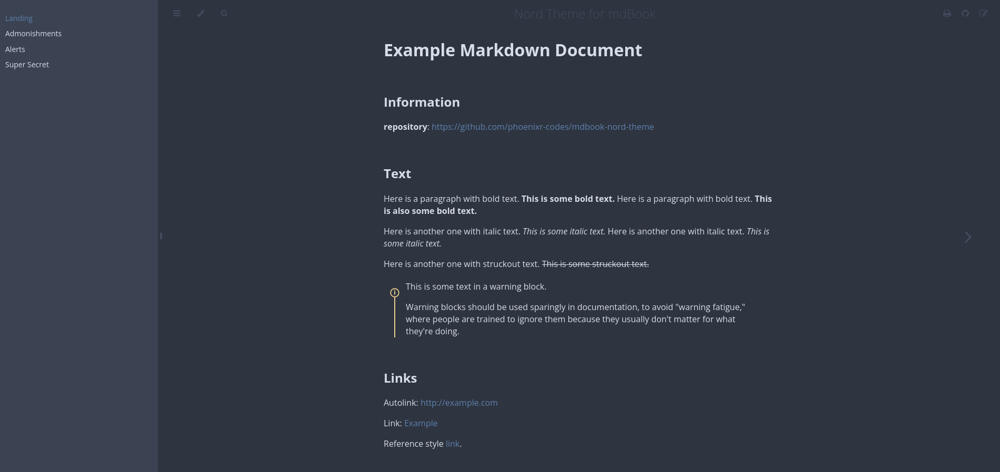
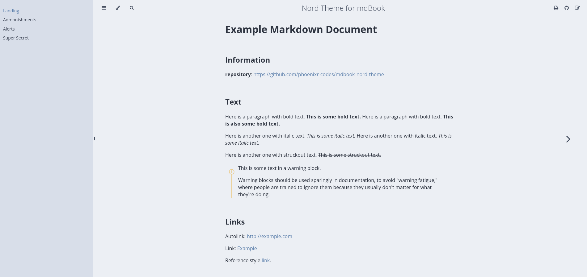

# Nord Theme for mdBook

**Live Demo**: <https://phoenixr-codes.github.io/mdbook-nord-theme>

## Installation

### Quick Install (*nix)

> [!IMPORTANT]
> You need the `index.hbs` created with `mdbook init --theme`.

In the directory containing `book.toml`, execute

```console
bash <(curl https://github.com/phoenixr-codes/mdbook-nord-theme/releases/latest/download/install.sh)
```

### Manual Installation

1. If you haven't already created a book, create one with: `mdbook init --theme` and delete all files in `theme/` except `index.hbs`.
2. Create the `theme/` directory of your mdBook directory if it does not exist already.
3. Copy all CSS files from the `src/` directory of this repository into the `theme/` directory of your mdBook directory.
4. Apply this addition to `book.toml`:
   ```toml
   [output.html]
   default-theme = "snow-storm"
   preferred-dark-theme = "polar-night"
   additional-css = [
     "./theme/nord.css",
     "./theme/nord-highlight.css",
     "./theme/nord-admonish.css",
     "./theme/mdbook-admonish.css",
     "./theme/nord-alerts.css",
   ]
   ```
4. Apply these additions to `index.hbs`:
   ```diff
     <li role="none"><button role="menuitem" class="theme" id="light">Light</button></li>
     <li role="none"><button role="menuitem" class="theme" id="rust">Rust</button></li>
     <li role="none"><button role="menuitem" class="theme" id="coal">Coal</button></li>
     <li role="none"><button role="menuitem" class="theme" id="navy">Navy</button></li>
     <li role="none"><button role="menuitem" class="theme" id="ayu">Ayu</button></li>
   + <li role="none"><button role="menuitem" class="theme" id="polar-night">Polar Night</button></li>
   + <li role="none"><button role="menuitem" class="theme" id="snow-storm">Snow Storm</button></li>
   ```
   ```diff
     <link rel="stylesheet" href="{{ path_to_root }}highlight.css">
     <link rel="stylesheet" href="{{ path_to_root }}tomorrow-night.css">
     <link rel="stylesheet" href="{{ path_to_root }}ayu-highlight.css">
   + <link rel="stylesheet" href="{{ path_to_root }}nord-highlight.css">
   ```

---

Repository layout and infrastructure inspired by <https://github.com/catppuccin/mdBook>.




